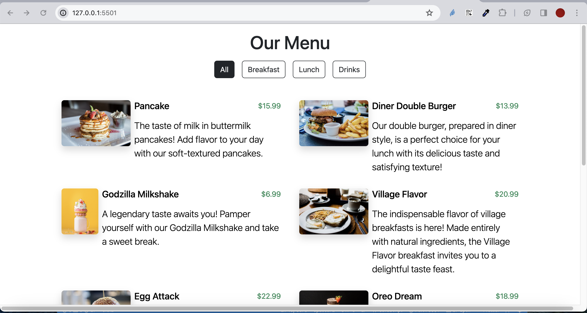

## QR-Menu
In this application, I created the QR-menu project using html, css and js. You can easily see product categories, product names, descriptions and prices through navigation in the menu.

## Used Technologies
-HTML
-CSS
-JAVASCRIPT

## Website link 
(https://denummenu.netlify.app)
## Screen

## Gif

